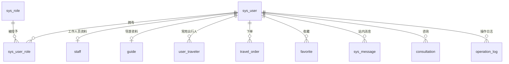
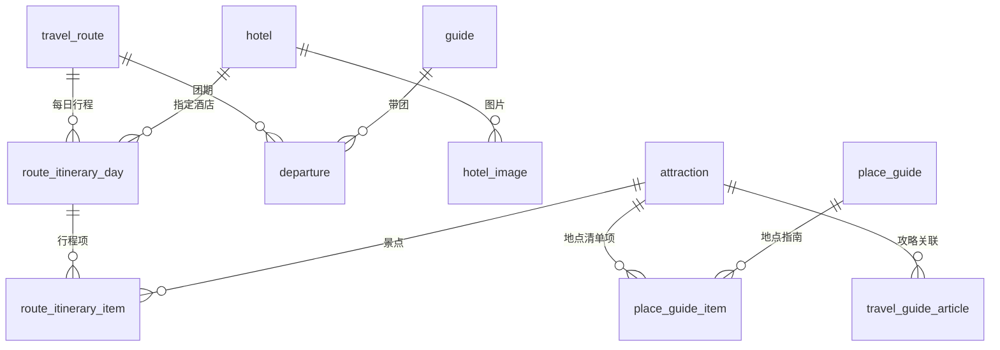
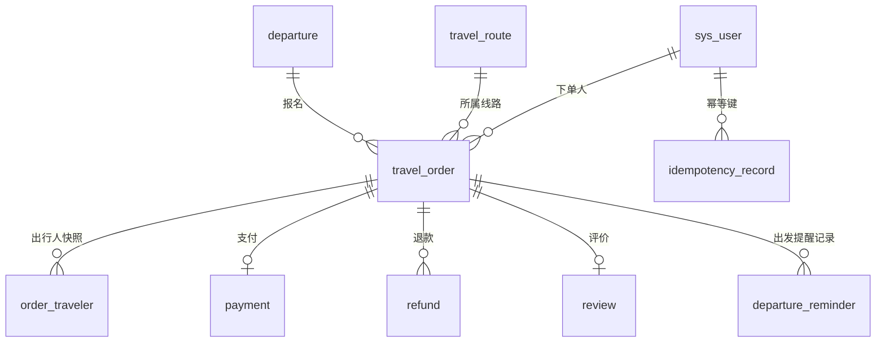

# 数据库设计说明

> 目标：给出本项目数据库的 **E-R 关系、表与索引说明、演示数据标注**。
>
> 规范来源：结构基线 `sql/schema.sql`，增量变更 `sql/migrations/NNN-*.sql`（清单与执行方式见
> [迁移说明](../sql/migrations/README.md)，本文不重复维护），
> 协作规则见 [CONTRIBUTING §12](../CONTRIBUTING.md)。全部业务数据来自数据库，禁止硬编码假数据（[DEVELOPMENT_GUIDE §5](DEVELOPMENT_GUIDE.md)）。

## 1. 基线与迁移策略

- `sql/schema.sql`：**全量基线**，面向全新库，通篇 `CREATE TABLE IF NOT EXISTS`。
- `sql/migrations/`：**增量迁移**，面向已存在的库；按 `NNN-描述.sql` 命名、按序号执行。
- 两者必须同步：任何结构变更都要同时补回 `schema.sql`。
- `sql/test-data.sql`：演示/测试数据，**每次初始化全新库时导入**；不通过重复导入修复存量库。

> ⚠️ 对已存在的库重复执行 `schema.sql` **不会**补齐后加的列/索引（`IF NOT EXISTS` 只保证不报错），
> 升级存量库必须执行 `migrations/` 中尚未应用的脚本。

## 2. E-R 图

### 2.1 用户与权限



### 2.2 线路、行程与资源



### 2.3 订单与交易



**核心口径**（详见 [ARCHITECTURE](ARCHITECTURE.md)）：`TravelRoute` 是可复用线路，`Departure` 是具体出发团期；
订单必须关联具体团期；下单时把团期价格与出行人复制成订单快照，历史订单不随当前资料变化。

## 3. 表清单

| 分组 | 表 | 说明 |
|---|---|---|
| 用户与权限 | `sys_user` / `sys_role` / `sys_user_role` | 账号、角色、关系 |
| | `staff` / `guide` | 工作人员、导游资料 |
| | `user_traveler` | 用户常用出行人 |
| 线路与资源 | `travel_route` | 旅游线路 |
| | `route_itinerary_day` / `route_itinerary_item` | 每日行程与行程项 |
| | `attraction` / `hotel` / `hotel_image` | 景点、酒店、酒店图片 |
| | `place_guide` / `place_guide_item` | 地点指南与清单 |
| | `travel_guide_article` | 旅游攻略 |
| 团期与预订 | `departure` | 团期（销售单元） |
| | `travel_order` / `order_traveler` | 订单、出行人快照 |
| 交易 | `payment` / `refund` / `review` / `favorite` | 支付、退款、评价、收藏 |
| 消息与协作 | `sys_message` | 站内消息 |
| | `consultation` / `consultation_reply` | 咨询与回复 |
| | `operation_log` | 后台操作日志 |
| 基础设施 | `idempotency_record` | 幂等键记录 |
| | `departure_reminder` | 出发提醒发送记录（本次新增） |
| 数据治理 | `data_source` | 数据来源与许可登记 |

## 4. 重点表字段与索引

### 4.1 `travel_order`（订单）

| 字段 | 类型 | 说明 |
|---|---|---|
| `order_no` | VARCHAR(40) UNIQUE | 业务单号，幂等对外标识 |
| `user_id` / `route_id` / `departure_id` | BIGINT | 下单人、线路、团期（外键） |
| `adult_count` / `child_count` | INT | 成人与儿童人数 |
| `adult_unit_price` / `child_unit_price` | DECIMAL(12,2) | **下单时价格快照** |
| `total_amount` | DECIMAL(12,2) | 订单金额（`BigDecimal`，禁止 float/double） |
| `status` | VARCHAR(32) | 订单状态机 |
| `payment_status` | VARCHAR(20) | UNPAID / PAID / REFUNDED |
| `paid_at` / `confirmed_at` / `cancelled_at` / `completed_at` | DATETIME | 关键时间戳 |

索引：`uk_order_no`（唯一）、`idx_order_user_status(user_id,status)`、`idx_order_departure(departure_id)`、`idx_order_created_at(created_at)`。
> `idx_order_created_at` 由 `005` 迁移补入，支撑后台工作台的今日订单数与订单趋势查询。

### 4.2 `departure`（团期）

| 字段 | 类型 | 说明 |
|---|---|---|
| `route_id` / `guide_id` | BIGINT | 线路、导游（外键） |
| `start_date` / `end_date` | DATE | 出发/返程日期 |
| `adult_price` / `child_price` | DECIMAL(12,2) | 销售单价 |
| `max_people` | INT | 名额上限 |
| `reserved_people` / `confirmed_people` | INT | 已预留（待支付/待确认） / 已确认 |
| `status` | VARCHAR(20) | DRAFT / OPEN / FULL / CLOSED / TRAVELLING / FINISHED / CANCELLED |
| `version` | INT | 乐观锁版本号 |

索引：`idx_departure_route_date(route_id,start_date)`、`idx_departure_status(status)`、外键 `fk_departure_route` / `fk_departure_guide`。
> **剩余名额**在服务层按 `max(max_people - reserved_people - confirmed_people, 0)` 计算，写入路径用条件 `UPDATE` 保证不超卖。

### 4.3 `departure_reminder`（出发提醒发送记录，本次新增）

| 字段 | 类型 | 说明 |
|---|---|---|
| `order_id` | BIGINT NOT NULL | 订单（外键 → `travel_order.id`） |
| `remind_type` | VARCHAR(32) NOT NULL | 提醒类型，如 `DEPARTURE_REMINDER` |
| `sent_at` | DATETIME NOT NULL | 发送时间 |
| `created_at` / `updated_at` | DATETIME | 审计字段 |

- **唯一键** `uk_departure_reminder_order_type(order_id, remind_type)`：同一订单同类提醒只发一次，
  是「定时任务重复执行不重复发消息」的原子闸门。
- 索引 `uk_departure_reminder_order_type` 同时服务 `order_id` 前缀查询。

### 4.4 `sys_message`（站内消息）

| 字段 | 类型 | 说明 |
|---|---|---|
| `user_id` | BIGINT NOT NULL | 接收人（外键 → `sys_user.id`） |
| `type` | VARCHAR(32) NOT NULL | 消息类型（如 `PAYMENT_SUCCESS` / `DEPARTURE_STATUS` / `DEPARTURE_REMINDER`） |
| `title` / `content` | VARCHAR(128)/(1000) | 标题与正文 |
| `read_flag` / `read_at` | TINYINT / DATETIME | 已读标记与时间 |

索引：`idx_message_user_read(user_id, read_flag)`，支撑未读计数与列表过滤。

### 4.5 资源相关

- `hotel.version`（`008` 迁移补入）：两位工作人员先后保存同一条酒店资料时以乐观锁返回冲突，而非静默覆盖。
- `route_itinerary_day` 的住宿字段：`accommodation_type`（`HOTEL|STANDARD|NONE|PENDING`）、`accommodation_standard`、`room_type`、`breakfast_included`、`accommodation_note`，并有约束 `ck_day_accommodation` 保证住宿类型与酒店关联/标准自洽（`010` 迁移补入）。
- `hotel_image` 唯一/排序索引 `idx_hotel_image_hotel(hotel_id, sort_order, id)`。
- `route_itinerary_day` 唯一键 `uk_route_day(route_id, day_number)` 保证同线路天序号不重复；`idx_day_hotel(hotel_id)` 支撑按酒店反查行程。

### 4.6 索引一览（非主键）

| 表 | 索引 | 列 | 类型 |
|---|---|---|---|
| travel_order | uk_order_no | order_no | 唯一 |
| travel_order | idx_order_user_status | user_id,status | 普通 |
| travel_order | idx_order_departure | departure_id | 普通 |
| travel_order | idx_order_created_at | created_at | 普通 |
| departure | idx_departure_route_date | route_id,start_date | 普通 |
| departure | idx_departure_status | status | 普通 |
| departure_reminder | uk_departure_reminder_order_type | order_id,remind_type | 唯一 |
| payment | uk_payment_order / uk_payment_no | order_id / payment_no | 唯一 |
| refund | idx_refund_status | status | 普通 |
| review | uk_review_order | order_id | 唯一 |
| favorite | uk_favorite_user_route | user_id,route_id | 唯一 |
| idempotency_record | uk_idempotency_user_scope_key | user_id,scope,idem_key | 唯一 |
| sys_message | idx_message_user_read | user_id,read_flag | 普通 |
| hotel | idx_hotel_city | city | 普通 |
| hotel_image | idx_hotel_image_hotel | hotel_id,sort_order,id | 普通 |
| route_itinerary_day | uk_route_day / idx_day_route / idx_day_hotel | route_id,day_number / route_id / hotel_id | 唯一/普通 |
| route_itinerary_item | idx_item_day | day_id | 普通 |
| place_guide | idx_place_guide_status_published / idx_place_guide_city / idx_place_guide_author | — | 普通 |
| place_guide_item | uq_place_guide_attraction / uq_place_guide_order | guide_id,attraction_id / guide_id,sort_order | 唯一 |
| attraction | idx_attraction_city | city | 普通 |
| travel_route | idx_route_status / idx_route_destination | status / destination | 普通 |

（完整清单以 `sql/schema.sql` 为准。）

## 5. 演示数据标注

- `sql/test-data.sql` 全部为**课程测试/演示数据**，不代表真实旅行社经营数据；账号、订单、联系方式、评价均为虚构。
- `data_source` 表登记了演示数据的来源与许可：
  | data_name | source | source_type | license |
  |---|---|---|---|
  | 演示景点与线路基础资料 | 团队原创整理的课程测试数据 | TEAM_TEST_DATA | 仅限课程项目开发、测试与答辩演示 |
  | 扩展线路、订单与攻略测试资料 | 团队原创整理的课程测试数据 | TEAM_TEST_DATA | 仅限课程项目开发、测试与答辩演示 |
- 图片、景点、坐标的来源与许可清单见 [DATA_SOURCES.md](DATA_SOURCES.md)。

## 6. 数据一致性注意事项

### 6.1 `travel_route.valid_booking_count` 是计数器，不会自动对齐真实订单

该列由业务链路维护：工作人员确认报名时 `+1`，退款完成时 `-1`。
但 `test-data.sql` 为演示效果直接预置了较大的数值（如 `106`），因此它与库中真实的
`CONFIRMED / TRAVELLING / COMPLETED` 订单数之间存在一个**固定的偏差**。

⚠️ **这个偏差不会自动修正。** 后续的 `+1 / -1` 只是在这个预置基数上做增减：
确认一单让它变成 107，退款一单让它变回 106，永远围绕预置基数浮动，而不是向真实订单数收敛。
要让它重新等于真实订单数，只能显式重算：

```sql
UPDATE travel_route r
SET valid_booking_count = (
    SELECT COUNT(*) FROM travel_order o
    WHERE o.route_id = r.id AND o.status IN ('CONFIRMED', 'TRAVELLING', 'COMPLETED'));
```

演示时需知晓由此带来的口径差异：

| 看板指标 | 数据来源 | 与真实订单的关系 |
|---|---|---|
| 热门线路 | `travel_route.valid_booking_count` | 预置基数 + 增量，可能明显高于真实订单数 |
| 热门目的地 | 按真实订单的有效报名人数统计 | 与真实订单一致 |

两者数量级不同属于演示数据的固有特征，不是功能缺陷；演示前可执行上面的重算语句对齐，
或直接说明「热门线路」展示的是演示基数。真实环境不应预置该列。

### 6.2 名额计数只由业务链路维护

名额计数只由下单 / 支付 / 退款 / 确认链路维护，禁止编辑接口整体写回实体覆盖计数
（`DepartureService.update` 用显式字段 `UPDATE`）。
